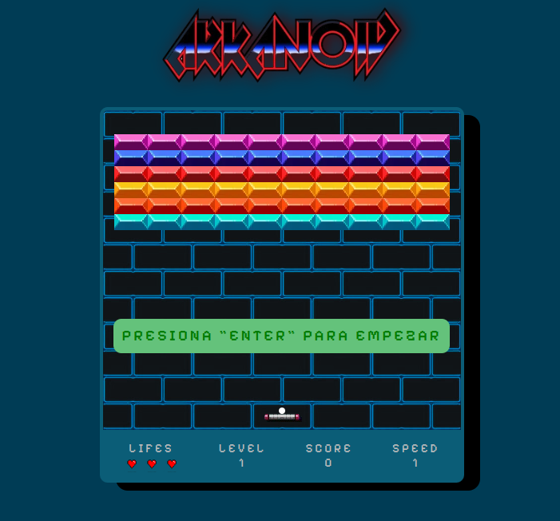

# Juego Arkanoid

creo una copia basica del juego Arkanoid con canvas

## Cosas a mejorar

- Bug con los ladrillos
- Bug con la pala
- Agregar mas niveles
- Aumentar Velocidad
- Disminuir tamaño de la pala dependiendo del nivel
- Textura a la pelota

## Screenshot

## Construido con 🛠️

- CSS
- JS puro
- Canvas
  
## Links

- Sitio en vivo : [vercel]()

## Licencia 📄

Este proyecto es de codigo libre 